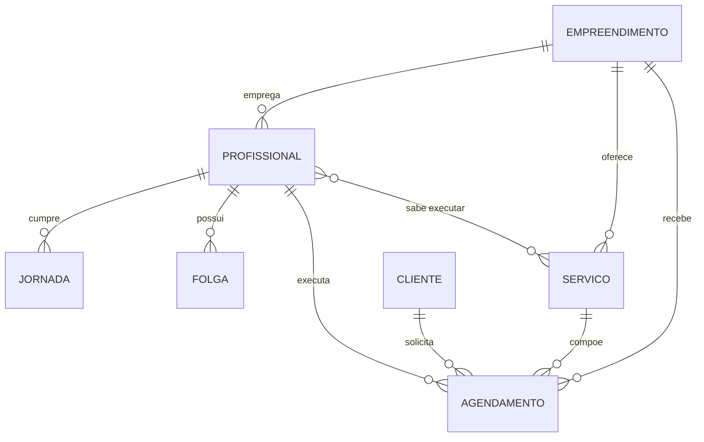

# Modelo de Domínio

> **FDD — Processo 1: Develop an Overall Model**
> Status: rascunho para revisão
> Multi-tenancy e contas de usuário: ver [ADR 0004](adr/0004-multi-tenancy-e-autenticacao.md) ·
> [ADR 0007](adr/0007-profissional-como-conta.md) (profissional também é conta)

---

## 1. Propósito

Estabelecer a linguagem e as estruturas do domínio antes de qualquer código.
Tudo que vier depois — arquitetura, features, telas — deriva daqui.

---

## 2. Requisitos extraídos

Rastreabilidade: cada requisito aponta para o trecho que o originou.

| ID | Requisito | Origem no texto |
|---|---|---|
| RF01 | Marcar horários de atendimento para clientes | *"unifica a marcação de horários de clientes"* |
| RF02 | Controlar a disponibilidade dos profissionais | *"controle de disponibilidade"* |
| RF03 | Impedir conflitos de agenda | *"evitar conflitos de agenda"*, *"agendamentos duplicados"* |
| RF04 | Exibir os horários livres de um profissional | *"otimizar os horários"* |
| RF05 | Medir o volume de atendimentos por funcionário | *"mensuração do volume de atendimentos por funcionário"* |
| RF06 | Apresentar métricas de produtividade da equipe | *"métricas precisas sobre o desempenho, a disponibilidade e a produtividade individual"* |
| RF07 | Gerir a escala dos profissionais | *"gestão da escala"* |

**Requisito não-funcional implícito:** o público-alvo são *"pequenos negócios que ainda operam de
forma analógica"*. Isso impõe **simplicidade de uso** como restrição de projeto — a ferramenta
precisa ser mais fácil que a agenda de papel que ela substitui.

---

## 3. Linguagem ubíqua

Termos do domínio usados de forma consistente em documentação, código e interface.

| Termo | Significado |
|---|---|
| **Empreendimento** | Salão ou barbearia cadastrado na plataforma; tem conta própria e seus funcionários |
| **Profissional** | Funcionário de um empreendimento que executa os serviços (cabeleireiro, manicure, esteticista) |
| **Cliente** | Quem recebe o atendimento; tem conta própria na plataforma e agenda em um ou mais empreendimentos |
| **Serviço** | O que é oferecido, com duração e preço definidos |
| **Agendamento** | Compromisso marcado: um cliente, um profissional, um serviço, uma data/hora |
| **Jornada** | Horário de trabalho recorrente de um profissional em um dia da semana |
| **Folga** | Ausência pontual em uma data específica, que anula a jornada daquele dia |
| **Escala** | Conjunto das jornadas e folgas de um profissional |
| **Disponibilidade** | Os intervalos de tempo em que um profissional pode receber agendamento |
| **Atendimento** | Agendamento que foi efetivamente realizado |

> Nota: *Agendamento* e *Atendimento* **não** são sinônimos. Agendamento é o compromisso;
> atendimento é o agendamento concluído. A distinção importa para as métricas (RF05, RF06).

---

## 4. Entidades

### Empreendimento

| Atributo | Tipo | Obrigatório | Observação |
|---|---|---|---|
| id | identificador | sim | igual ao `uid` da conta no Firebase Auth |
| nome | texto | sim | nome do salão/barbearia exibido ao cliente |
| telefone | texto | não | |
| cnpj | texto | sim | identificação do negócio |
| endereco | texto | sim | endereço completo, exibido na tela de detalhes |
| cidade | texto | sim | usado no filtro de busca por local (RF/feat_prot01) |
| ativo | booleano | sim | inativo não aparece na busca do cliente |

Dono de `Profissional` e `Serviço` — ver "Modelagem no Firestore" em `docs/arquitetura.md` para o
isolamento entre empreendimentos.

### Profissional

| Atributo | Tipo | Obrigatório | Observação |
|---|---|---|---|
| id | identificador | sim | igual ao `uid` da conta no Firebase Auth ([ADR 0007](adr/0007-profissional-como-conta.md)) |
| empreendimentoId | referência | sim | empreendimento ao qual o funcionário pertence |
| nome | texto | sim | |
| telefone | texto | não | |
| servicos | lista de Serviço | sim | quais serviços sabe executar (do mesmo empreendimento) |
| ativo | booleano | sim | inativo não aparece para agendamento |

Tem conta própria, mas **não se autocadastra**: o empreendimento define e-mail e senha ao
cadastrar o profissional. Com a conta, o profissional acessa sua própria agenda e ajusta sua
jornada e folgas.

### Serviço

| Atributo | Tipo | Obrigatório | Observação |
|---|---|---|---|
| id | identificador | sim | |
| empreendimentoId | referência | sim | empreendimento ao qual o serviço pertence |
| nome | texto | sim | ex.: "Corte feminino" |
| duracaoMinutos | inteiro | sim | base do cálculo de horário |
| preco | decimal | sim | |
| ativo | booleano | sim | |

### Cliente

| Atributo | Tipo | Obrigatório | Observação |
|---|---|---|---|
| id | identificador | sim | igual ao `uid` da conta no Firebase Auth |
| nome | texto | sim | |
| telefone | texto | sim | principal forma de contato no setor |
| cpf | texto | sim | identificação da pessoa |

Entidade **global**: a mesma conta de cliente agenda em empreendimentos diferentes, não pertence a
nenhum deles.

### Agendamento

| Atributo | Tipo | Obrigatório | Observação |
|---|---|---|---|
| id | identificador | sim | |
| empreendimentoId | referência | sim | empreendimento em que o agendamento foi feito |
| clienteId | referência | sim | |
| profissionalId | referência | sim | deve pertencer ao mesmo `empreendimentoId` (RN09) |
| servicoId | referência | sim | deve pertencer ao mesmo `empreendimentoId` (RN09) |
| inicio | data e hora | sim | |
| fim | data e hora | sim | derivado: `inicio + servico.duracaoMinutos` |
| status | enum | sim | `Agendado` · `Realizado` · `Cancelado` · `Falta` |
| observacao | texto | não | |

> `fim` é **derivado**, mas fica armazenado: a duração do serviço pode mudar depois, e o
> agendamento precisa preservar o horário que foi combinado com o cliente.

### Jornada

| Atributo | Tipo | Obrigatório | Observação |
|---|---|---|---|
| id | identificador | sim | |
| profissionalId | referência | sim | |
| diaSemana | enum | sim | segunda … domingo |
| horaInicio | hora | sim | |
| horaFim | hora | sim | |

Um profissional tem **uma jornada por dia da semana em que trabalha**. Dia sem jornada = dia não
trabalhado.

### Folga

| Atributo | Tipo | Obrigatório | Observação |
|---|---|---|---|
| id | identificador | sim | |
| profissionalId | referência | sim | |
| data | data | sim | |
| motivo | texto | não | |

---

## 5. Diagrama de entidades



---

## 6. Regras de negócio

O coração do sistema. São estas regras que separam o app de uma planilha.

| ID | Regra | Origem |
|---|---|---|
| **RN01** | Um agendamento não pode se sobrepor a outro agendamento ativo do mesmo profissional | RF03 |
| **RN02** | O agendamento deve estar dentro da jornada do profissional naquele dia da semana | RF02 |
| **RN03** | Não é permitido agendar em data de folga do profissional | RF02 |
| **RN04** | O profissional só pode ser agendado para serviços que sabe executar | RF01 |
| **RN05** | O agendamento não pode ultrapassar o fim da jornada do dia | RF02 |
| **RN06** | Não é permitido criar agendamento em data/hora passada | RF01 |
| **RN07** | Agendamento `Cancelado` ou `Falta` libera o horário para novo agendamento | RF03 |
| **RN08** | Apenas profissionais e serviços ativos podem ser usados em novos agendamentos | RF01 |
| **RN09** | O profissional e o serviço de um agendamento devem pertencer ao mesmo empreendimento do agendamento | ADR 0004 |

**Sobre RN01 — definição de sobreposição.** Dois agendamentos A e B conflitam quando:

```
A.inicio < B.fim   E   B.inicio < A.fim
```

Encostar não é conflito: um agendamento que termina 10:00 e outro que começa 10:00 convivem.
Esta é a regra com mais casos de borda do sistema e será desenvolvida com **teste primeiro**,
conforme a convenção de TDD pontual.

---

## 7. Valores derivados

Não são armazenados — calculados sob demanda.

| Valor | Cálculo | Atende |
|---|---|---|
| **Horários livres** | jornada do dia − folga − agendamentos ativos − duração do serviço desejado | RF04 |
| **Atendimentos realizados** | contagem de agendamentos com status `Realizado` no período | RF05 |
| **Minutos ocupados** | soma das durações dos agendamentos `Realizado` | RF06 |
| **Minutos disponíveis** | soma das jornadas do período − folgas | RF06 |
| **Taxa de ocupação** | minutos ocupados ÷ minutos disponíveis | RF06 |

A **taxa de ocupação** é a métrica central do trabalho: é ela que traduz *"produtividade
individual"* em número comparável entre profissionais com jornadas diferentes.

---

## 8. Premissas de escopo

Decisões tomadas para manter o projeto enxuto. Registradas para que o limite do escopo fique
explícito e não seja reaberto por engano no meio do desenvolvimento.

| # | Premissa | Justificativa |
|---|---|---|
| ~~P1~~ | ~~Salão único. Não há entidade `Salão` nem multi-tenant~~ | **Revisada pelo ADR 0004** — a plataforma passou a atender múltiplos empreendimentos |
| ~~P2~~ | ~~Sem autenticação por perfil. Uso administrativo interno~~ | **Revisada pelo ADR 0004** — cliente e empreendimento autenticam via Firebase Auth |
| ~~P3~~ | ~~Cliente não acessa o sistema. Quem agenda é o salão~~ | **Revisada pelo ADR 0004** — o cliente tem conta própria e agenda diretamente |
| P4 | **Sem controle financeiro.** `preco` existe apenas como dado do serviço | Fora do escopo|
| P5 | **Sem notificações** (e-mail, SMS, WhatsApp) | Dependência externa desnecessária ao objetivo |
| ~~P6~~ | ~~Linguagem do domínio em português no código~~ | **Revisada pelo [ADR 0005](adr/0005-idioma-do-codigo.md)** — código em inglês, documentação e texto de tela continuam em português |
| P7 | **Sem Custom Claims / Cloud Functions.** O tipo de conta (cliente/empreendimento) é resolvido lendo `usuarios/{uid}` no Firestore, não no token de autenticação | Evita reintroduzir backend — coerente com o ADR 0002. Ver ADR 0004 |

---

## 9. Questões em aberto

| # | Questão | Impacto |
|---|---|---|
| Q1 | **Persistência: Firebase ou SQLite?** | Bloqueia a Etapa 2 (Walking Skeleton) → ADR 0002 |
| Q2 | Serviço pode ter duração variável por profissional? | Se sim, muda o cálculo de `fim` e a relação Profissional↔Serviço |
| Q3 | Precisa de intervalo entre atendimentos (limpeza/descanso)? | Se sim, entra como regra na RN01 |
